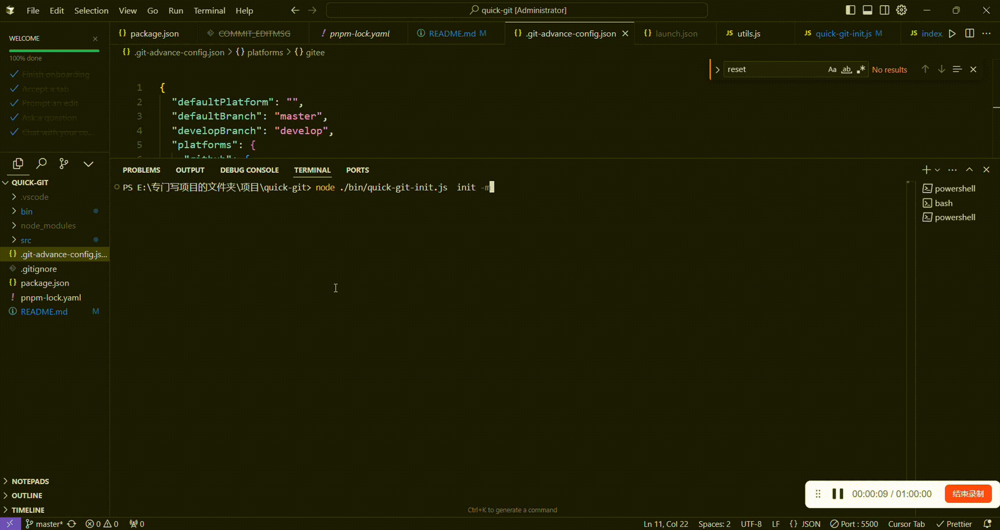

---
<div align="center">
<h1>🚀 Quick Git Advance</h1>
<p>Git 仓库初始化方案，让仓库创建/初始化/ignore文件一步到位 解放双手</p>
</div>
---

👉 [GitHub 仓库地址](https://github.com/LiCHUYA/quick-git-advance-v2)
👉 [Gitee 仓库地址](https://gitee.com/chen-jingsheng-123/quick-git-advance-v2)

## ✨ 特性一览

- 🎯 **一键初始化** - 从本地到远程，一条命令搞定
- 🔄 **双平台支持** - 无缝集成 GitHub 和 Gitee
- 🛡️ **智能检测** - 全方位冲突检查，避免误操作
- 🔑 **自动配置** - SSH 密钥自动生成与配置
- 📝 **交互友好** - 智能引导，清晰提示
- 🎨 **高度可定制** - 灵活的配置选项
- 🔧 **错误处理** - 完善的错误恢复机制
- 📦 **项目模板** - 内置多种 .gitignore 模板

## 🚀 为什么选择 Quick Git Advance？

## 💡 痛点洞察：传统 Git 初始化流程的 7 大问题

1. **重复劳动**：每次都要重复`git init`、`git remote add`等命令
2. **平台切换**：GitHub/Gitee 配置差异导致操作不一致
3. **网络延迟**：国内访问 GitHub 经常超时
4. **模板缺失**：手动创建.gitignore 效率低下
5. **配置分散**：SSH 密钥、Token 等配置管理混乱
6. **分支冲突**：main/master 分支命名混乱
7. **错误排查**：认证失败等问题定位困难

| 传统步骤                  | 存在问题              |
| ------------------------- | --------------------- |
| 1. 访问 GitHub/Gitee 网站 | ⏰ 流程繁琐，耗时较长 |
| 2. 手动创建仓库           | 🔍 需要记忆多个命令   |
| 3. 配置 SSH 密钥          | ⚠️ 容易出错和遗漏     |
| 4. 本地初始化 Git         | 📝 重复性工作多       |
| 5. 编写 .gitignore        | 🔒 安全配置复杂       |
| 6. 设置远程仓库           | 🌐 多平台切换麻烦     |
| 7. 推送代码               |                       |

### Quick Git Advance 的优势

- 可通过一行命令一键完成 git 仓库全部初始化流程,自动配置 SSH 推送
- 可通过一行命令生成你想要的.gitignore 文件

| 核心优势     | 具体表现                                                                                                                                     |
| ------------ | -------------------------------------------------------------------------------------------------------------------------------------------- |
| **效率提升** | - 一键完成全部初始化流程<br> - 智能默认值，减少输入<br> - 配置持久化，一次设置永久生效<br> - 批量操作支持<br> - 一键生成.gitignore 文件 <br> |
| **安全可靠** | - 自动化 SSH 密钥管理<br> - 令牌安全存储<br> - 操作前自动检查<br> - 失败自动回滚                                                             |
| **用户体验** | - 清晰的命令行界面<br> - 智能的交互引导<br> - 详细的错误提示<br> - 完整的操作日志                                                            |
| **功能完备** | - 支持主流平台<br> - 完整的分支管理<br> - 灵活的配置选项<br> - 丰富的模板支持                                                                |

## 📦 安装

```bash
# NPM
npm install -g quick-git-advance

# Yarn
yarn global add quick-git-advance

# PNPM
pnpm add -g quick-git-advance
```

## 🎯 快速开始

### 基础用法

```bash
# 进入项目目录
cd your-project

# 初始化仓库（交互式）
quick-git-advance init
```

### 核心讲解

> 核心为以下 4 个命令

- quick-git-advance init 一键初始化并推送仓库

  - -m
  - --multi 创建多仓库

- quick-git-advance config 配置文件
  - --edit 修改
  - --list 查看
- quick-git-advance ignore 创建 ignore 文件
- quick-git-advance reset 初始化配置

### 初始化流程交互

```bash
$ quick-git-advance init
```

> 当输入命令后 会检测当前项目目录下是否含有`.git`文件夹,有的话会弹出提示,没有的话,将继续进行下一步操作

交互示例：

```
仓库名称: my-project
? 选择代码托管平台: (使用方向键选择)
❯ GitHub
  Gitee

? 仓库可见性: (使用方向键选择)
❯ 公开 (Public)
  私有 (Private)

? 仓库描述: My awesome project

? 主分支名称: [main]

? 是否需要创建独立的开发分支? (Y/n)

? 开发分支名称: [develop]
```


> 如果有不同平台仓库想要同时使用这个项目 可以带参 -m



> 创建完整后推送代码 会自动的创建远程仓库 并进行推送 以及本地和远程分支的管理

```js
  git push //默认推送
  # 或
  git push gitee //推送到 gitee
  # 或
  git push github //推送到 github
```

### 配置管理交互

```bash
quick-git-advance config
```

交互示例：

> 当时有 windows 终端输入 quick-git-advance config --edit 时 会默认打开记事本编辑配置 而使用 git bash 打开 会默认打开 vim 进行编辑

```js

# 使用编辑器打开配置文件
quick-git-advance config --edit
# 或
quick-git-advance config -e

# 列出所有配置
quick-git-advance config --list
# 或
quick-git-advance config -l

```


### 生成.gitignore 文件

```js
quick-git-advance ignore
```

> 通过 quick-git-advance ignore 命令 可快速生成对应的 ignore 文件


### 初始化设置

```js
quick-git-advance reset
```

一键初始化配置文件

## 📝 详细功能说明

### 1. 初始化流程

1. **基本信息收集**

   - 仓库名称（支持验证）
   - 平台选择（GitHub/Gitee）
   - 仓库描述（可选，最大 255 字符）
   - 可见性设置

2. **冲突检测**

   - 检查本地目录是否存在
   - 检查是否已是 Git 仓库
   - 检查远程仓库是否存在
   - 提供冲突解决选项

3. **SSH 配置**

   - 检测现有 SSH 配置
   - 必要时自动生成密钥
   - 自动添加到远程平台
   - 自动测试连接

4. **仓库创建**

   - 创建远程仓库
   - 初始化本地仓库
   - 配置 .gitignore
   - 创建初始提交

5. **分支管理**
   - 配置主分支
   - 可选创建开发分支
   - 自动推送分支
   - 分支切换管理

## 📄 许可证

MIT License

## 📮 联系方式

- 作者：advance
- 邮箱：[203219348@qq.com]

---

如果这个工具帮助到你，请给个 Star ⭐️！

👉 [GitHub 仓库地址](https://github.com/LiCHUYA/quick-git-advance-v2)
👉 [Gitee 仓库地址](https://gitee.com/chen-jingsheng-123/quick-git-advance-v2)
